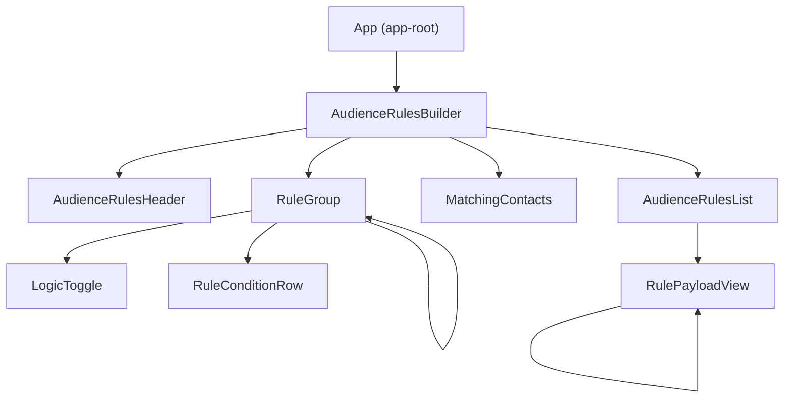

# Audience Rules Builder

Angular app for building audience targeting rules as a nested **AND/OR** tree of field conditions.

## Rule data model

Rules are trees. Each **group** combines its direct **conditions** and **nested groups** with a single logic operator:

| Property   | Meaning |
| ---------- | ------- |
| `logic`    | `AND` — every direct child must match; `OR` — at least one direct child must match. |
| `conditions` | Flat list of predicates on audience fields (`field` + `operator` + `value`). |
| `groups`   | Nested rule groups with the same shape (unbounded depth). |

### Field catalog

Supported fields and their operators live in `FIELD_CATALOG` in `rule-builder.model.ts` (exposed as `FIELD_OPTIONS`). Each field has its own operator set—for example `country` / `plan` use *is* / *is not*, `purchaseCount` uses numeric comparisons, `signupDate` uses *before* / *after* / *on*.

### Two representations

The app uses two TypeScript shapes for the same conceptual tree:

1. **Editor tree** (`RuleGroup` / `RuleCondition`)  
   Used in the UI. Each group and condition has a stable **`id`** (UUID) so rows and nested cards can be updated, removed, and patched without re-keying the whole tree.

2. **Serializable payload** (`RuleTreePayload.Group` / `RuleTreePayload.Condition`)  
   Used for **API requests and storage**: same nested structure, but **no ids**—only `logic`, `conditions`, and `groups`.  
   `toMinimalRuleGroup()` maps an editor tree to this payload by stripping ids and recursing into nested groups.

Saved rules from the API (`SavedAudienceRule`) include metadata (`id`, `name`, `savedAt`, `storedAt`) plus a `root` that is a `RuleTreePayload.Group`. Evaluate and save endpoints consume the minimal `root` shape.

### Validation (high level)

The builder enforces that each condition has a non-empty value, operators match the field, numeric/date fields parse correctly, and **each field appears at most once across the whole tree** (so the catalog acts like a set of dimensions, not repeated keys).

## Component relationships

The shell is **`App`** → **`AudienceRulesBuilder`**, which composes the header, the editable rule tree, matching preview, and the saved-rules list. **`RuleGroup`** is recursive: each group renders a **`LogicToggle`**, one **`RuleConditionRow`** per condition, and nested **`RuleGroup`** instances. **`AudienceRulesList`** embeds **`RulePayloadView`** inside each saved rule’s details; **`RulePayloadView`** is also recursive for nested groups in read-only form.

**Shared services** (not shown in the diagram): components inject **`RuleBuilderService`** for editor state (tree, validation, save) and **`AudienceRulesApiService`** for HTTP (`/rules`, `/evaluate`). The list refetches when the API service’s saved-rules version bumps after a successful save.

## Deployment (Vercel + Railway)

- **Frontend (Vercel):** static Angular browser build via `vercel.json` and `npm run build:vercel`. Set **`AUDIENCE_RULES_API_URL`** in Vercel to your API origin (no trailing slash); it is injected at build time.
- **Backend (Railway):** deploy the **`api/`** directory as a Node service (`npm start`). Set **`CORS_ORIGIN`** to your Vercel site URL so the browser can call the API.

Step-by-step instructions, env vars, and troubleshooting (CORS, local prod builds) are in [docs/DEPLOYMENT.md](docs/DEPLOYMENT.md).

## Improves in future
Frontend:
 1. better saved rules list design with pagination.
 2. Implementing app-wide Error Management model component allow user have better experience.
 3. Performance imporve like Memoize expensive computed values in the rule builder where needed (tree traversal can grow quickly).
 4. Accessibility polish.
 5. Cursor rules

Backend:
 1. Swap the in-memory rules = [] in api/ for a database (Railway Postgres).
 2. Add backend tests for CRUD (or at least contract tests).
 3. Add auth (even a simple API key) to prevent anyone from writing/evaluating arbitrary rules.
 4. Deploy SSR.
 5. GitHub Actions: run npm test and ng build --configuration development on PRs.
